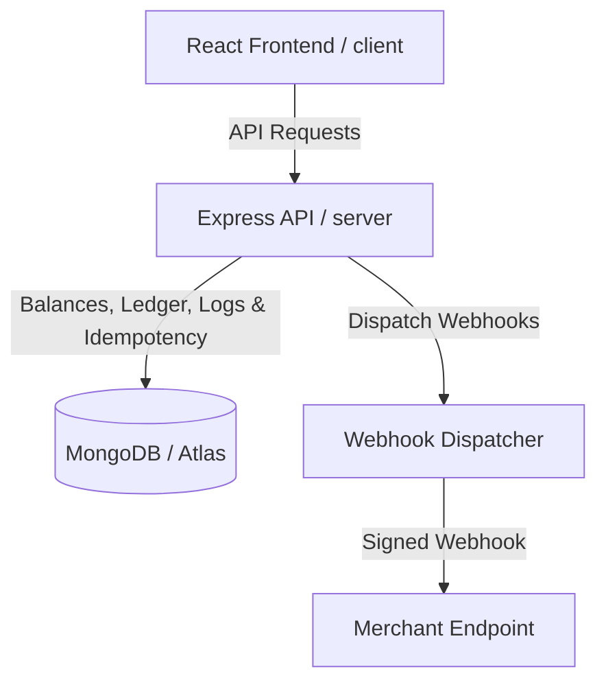

# FinCore — Digital Wallet & Payment Infrastructure Simulator

FinCore is a production-grade sandbox payment infrastructure simulator built to demonstrate transaction consistency, double-entry ledger accounting, reliable webhook delivery, and deterministic risk evaluation.

---

## 🚀 Key Features

* **Double-Entry Accounting Ledger**: Guaranteed balance consistency using strict credit/debit transaction records (total debits = total credits) posted within atomic database operations.
* **Concurrency-Safe Wallet Transfers**: Secure peer-to-peer transfers preventing account overdraws under parallel thread workloads via MongoDB atomic updates and optimistic concurrency conditions.
* **API Idempotency Protection**: Consolidated MongoDB-based idempotency layer ensuring that API transactions are executed exactly once for any unique request key.
* **Merchant Dashboard & API Keys**: Generate cryptographically secure API credentials, manage payment orders, and initiate partial or full checkout refunds.
* **Webhook Delivery**: Dispatch signed payloads with HMAC SHA-256 signatures, exponential backoffs, attempt logs, and manual console retries.
* **Deterministic Risk Engine**: Automatic transaction evaluation (flags velocity speed spikes, vetoes excessive transfer sums, and maintains audit trails).
* **Financial Reconciliation Engine**: Audit utility comparing payment records against posted double-entry ledger listings to identify and flag discrepancies.
* **Real-time Operations console**: Socket.io telemetry distributing instant notification alerts for risk rules, payment transitions, and audit issues.

---

## 🛠️ Technology Stack

* **Frontend**: React (Vite), Redux Toolkit, React Router, Socket.IO Client, Tailwind CSS
* **Backend**: Node.js, Express.js, Socket.IO Node Server
* **Database**: MongoDB (consolidated backend database using Mongoose ODM)
* **Testing**: Jest, Supertest (Mock-based self-contained integration test suite)

---

## 📊 System Architecture



Detailed architectural papers are available in the [docs/](file:///d:/FinCore/docs) folder:
* 🗺️ [System Architecture Overview](file:///d:/FinCore/docs/architecture.md)
* 📖 [Double-Entry Ledger Design](file:///d:/FinCore/docs/ledger.md)
* 🔄 [Payment Order States](file:///d:/FinCore/docs/payments.md)
* 🔑 [API Idempotency Controls](file:///d:/FinCore/docs/idempotency.md)
* 🔒 [Concurrency Control](file:///d:/FinCore/docs/concurrency.md)
* 🔌 [Webhook Retries](file:///d:/FinCore/docs/webhooks.md)
* 🔎 [Ledger Reconciliation Audits](file:///d:/FinCore/docs/reconciliation.md)
* 🛡️ [Security & RBAC Protections](file:///d:/FinCore/docs/security.md)
* 🧪 [Mock-based Testing Harness](file:///d:/FinCore/docs/testing.md)
* ⚡ [Database Indexes & Performance](file:///d:/FinCore/docs/performance.md)

---

## ⚙️ Getting Started

### Manual Local Startup

If running services natively on your local machine:

#### Prerequisites
Ensure the following services are running:
* Node.js (v18+)
* MongoDB (Atlas URI or local instance)

#### Installation

1. Clone the repository and install dependencies in both directories:
   ```bash
   # Install server dependencies
   cd server && npm install
   
   # Install client dependencies
   cd ../client && npm install
   ```

2. Set up environment variables in `server/.env`:
   ```env
   PORT=5000
   NODE_ENV=development
   JWT_ACCESS_SECRET=sandbox_access_secret_key_long_string_123456
   JWT_REFRESH_SECRET=sandbox_refresh_secret_key_long_string_123456
   MONGO_URI=mongodb+srv://your_connection_string
   ```

3. Launch backend API server:
   ```bash
   cd server
   npm run dev
   ```

4. Launch client React development server:
   ```bash
   cd client
   npm run dev
   ```
   Open `http://localhost:5173` to access the application UI.

---

## 🧪 Testing

The platform features 32 robust integration tests designed with in-memory DB mocking adapters. They run in under 15 seconds without needing any external database service instances.

To execute tests:
```bash
cd server
npm test
```
