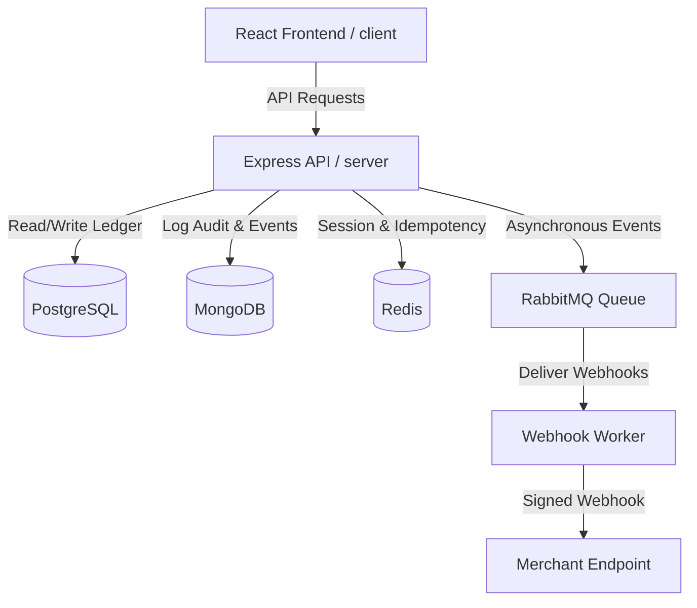

# FinCore Project Specification

## 1. Overview
FinCore is a production-grade simulated payment infrastructure sandbox. It implements digital wallets, customer-to-customer peer transfers, merchant checkout systems, and transactional ledgers using double-entry accounting.

## 2. System Architecture

## 3. Database Ledger Schema (PostgreSQL)
- **users**: Accounts with role definitions (CUSTOMER, MERCHANT, ADMIN, AUDITOR).
- **wallets**: Tracks available and pending integer minor unit balances.
- **ledger_transactions**: Tracks transaction header records.
- **ledger_entries**: Double-entry ledger postings enforcing total debits = total credits.
- **payments**: Tracks payment order states and transactions.
- **transfers**: Tracks customer-to-customer transfer records.

## 4. Security Principles
- Password hashing via `bcryptjs`.
- JWT-based authentication using short-lived Access Tokens and HTTP-only cookie-based Refresh Tokens.
- Role-based Access Controls (RBAC) enforced via router-level gates in frontend and backend.
- Rate limiting implemented on authentication endpoints.
