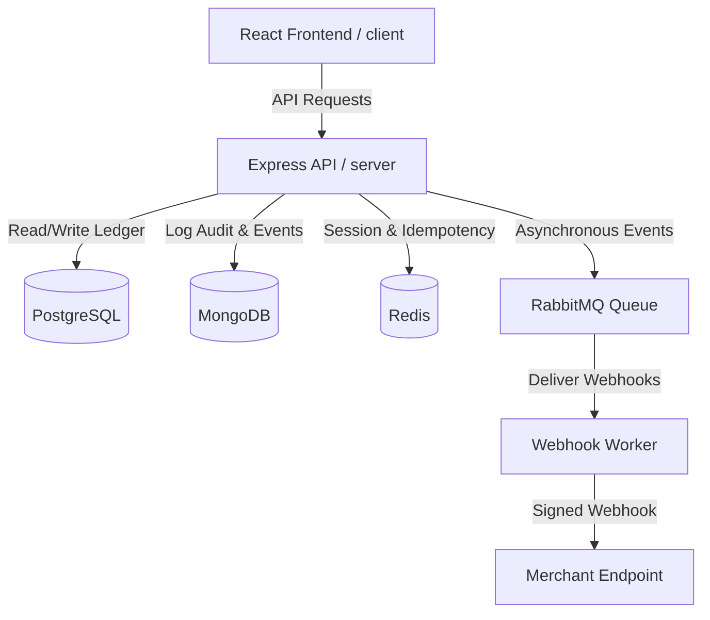

# System Architecture

FinCore is built as a modular monolith designed to simulate sandbox payment infrastructure.

## Component Overview

### 1. Frontend (client/)
* **React + Vite**: For high-performance asset compiling.
* **Redux Toolkit**: Manages active auth states, user roles, and loading overlays.
* **React Router**: Controls route gating via `ProtectedRoute` helper to enforce Role-Based Access Control (RBAC).
* **Socket.IO Client**: Establishes live telemetry connections for real-time notifications.
* **Tailwind CSS**: Cohesive, responsive dashboard structures for Customers, Merchants, and Admins.

### 2. Backend (server/)
* **Express.js API**: Handles RESTful web requests. Organized as a modular structure with controllers, services, repositories, and routes.
* **Socket.IO Node Server**: Distributes real-time transaction updates, risk alerts, and reconciliation discrepancies to active dashboard sessions.
* **RabbitMQ Worker Queue**: Dequeues and processes asynchronous tasks such as webhook event dispatches.

### 3. Data Infrastructure
* **PostgreSQL (Transactional Store)**: Manages relational, ACID-compliant database tables (Users, Wallets, double-entry Ledger, Payments, Refunds, and Webhook Configurations).
* **MongoDB (Audit & Event Log)**: Stores schema-less, chronological logs for immutable risk checks, webhook delivery logs, and audit logs.
* **Redis (Caching, Rate Limiting & Locking)**: Tracks idempotency keys, manages request velocity limits, and provides temporary caching state.
