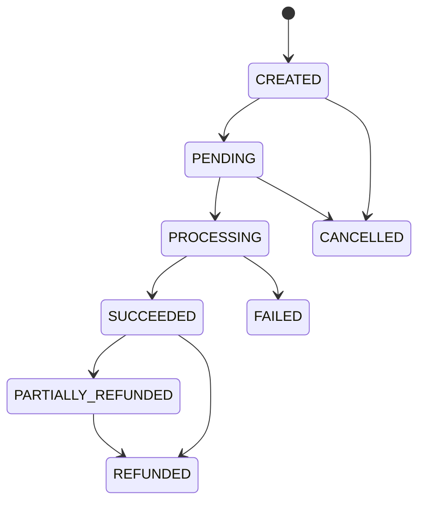

# Payment Lifecycle

FinCore features a simulated merchant payment order system driven by a strict state machine.

## Payment States

## Flow Description
1. **CREATED**: Merchant generates a payment order using their Sandbox API Key. The payment is initialized with an amount, currency, and custom reference metadata.
2. **PENDING**: The customer visits the checkout session.
3. **PROCESSING**: The customer clicks "Confirm" to authorize the checkout session. The system locks the wallets, checks for sufficient available balances, and runs deterministic risk rules.
4. **SUCCEEDED**: Balance is debited from the customer's wallet and credited to the merchant's wallet. Simultaneously, balanced entries are posted to the double-entry ledger within the database transaction block.
5. **FAILED / CANCELLED**: If risk limits are violated, available balances are insufficient, or the merchant cancels the order, it transitions to these end states.
6. **PARTIALLY_REFUNDED / REFUNDED**: Successful payments can have refunds issued against them. If total refunds match the payment amount, it enters the `REFUNDED` status.
